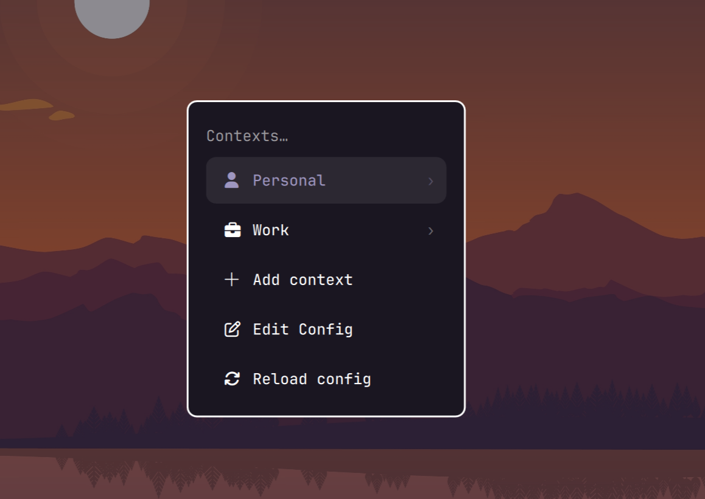
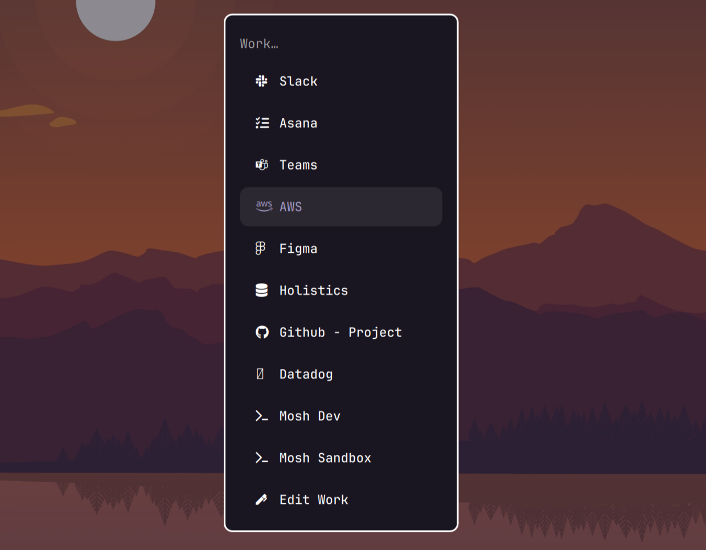
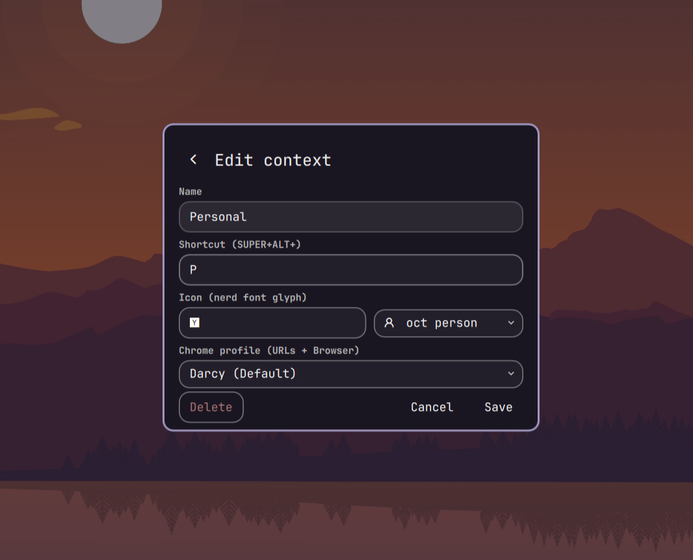
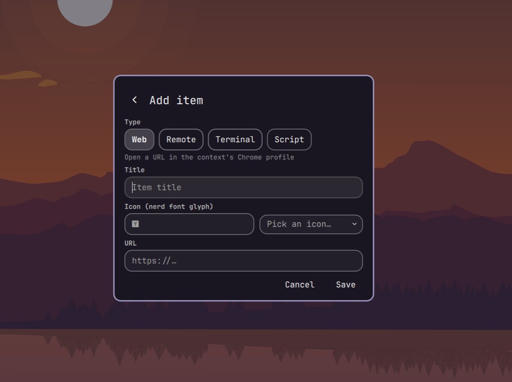
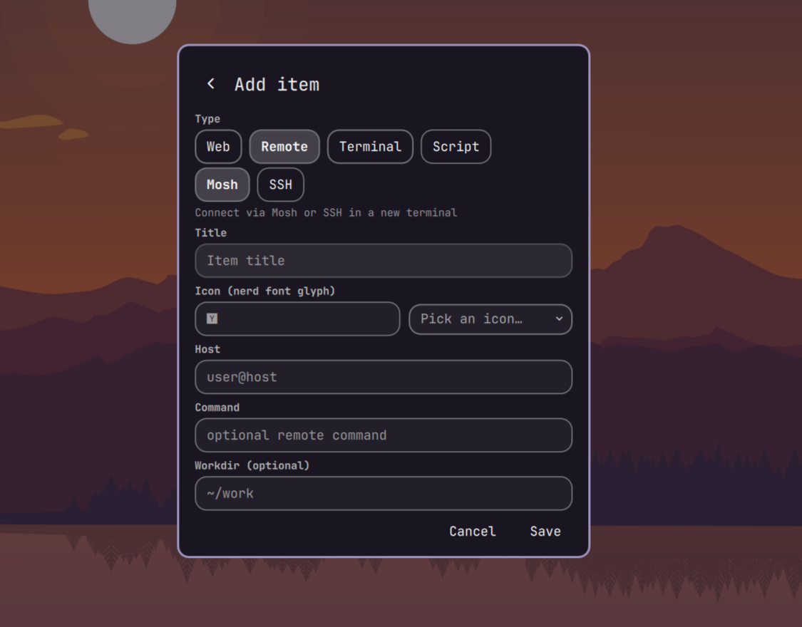
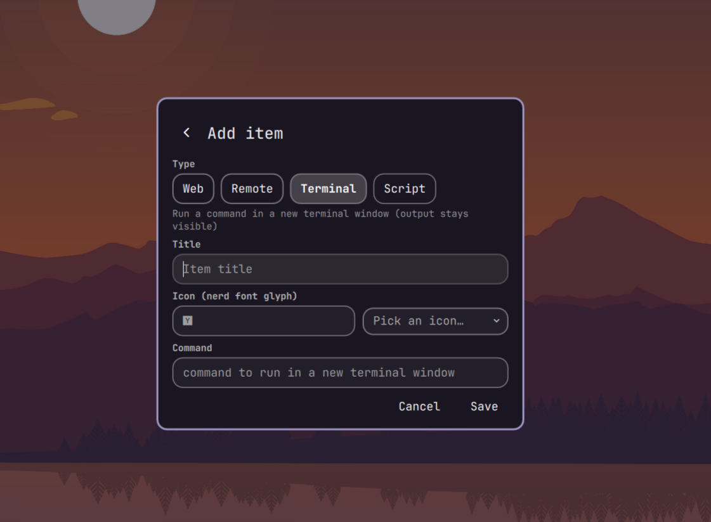

# omarchy-context-switcher


 
 
 
 
 
 

Group your workspaces into named **contexts** — Personal, Work, Gaming, Infra,
whatever fits how you actually work — each with its own set of workspaces, its
own browser profile, and its own one-click launch menu.

Flip between entire "modes" of work with a single key: switch to **Work** and
all your work windows, apps, and work browser profile are one key away. Switch
back to **Personal** and your home workspaces, personal bookmarks, and default
browser are waiting. You can create as many contexts as you want — a client,
a hobby, a side project, a machine — and hop between them freely.

## Why you'd want it

- **One workspace per task, organized by context.** Each context owns a block
  of slots (e.g. 1–10). Jump straight to a slot, move a window to one, or
  cycle through them without ever getting lost in a sea of workspaces.
- **Per-context browser profile.** Launch any web app or the whole browser in
  the right profile automatically — each context picks its own profile, so one
  client's sites open in that client's browser profile and your personal sites
  in your default. No more mixing work and personal tabs.
- **Everything launches from the searchable system menu.** Contexts, apps, SSH
  sessions, and terminals are a type-and-Enter away, and each context carries
  its own curated menu of what you use.
- **Manage it without touching config files.** Add/edit/delete contexts and
  items, set profiles, and reorder launch items right from the menu.

## How it fits together

- **Bar widget** — shows the active context name and its slot occupancy. Click
  the name for the context menu; click a slot to go there; right-click to jump
  to the next context.
- **Searchable context menu** — a "Contexts" section in the system menu. Drill
  into a context to launch any of its items (web app, browser, SSH/Mosh,
  terminal, or script), or use its **Edit** menu to change details, add/reorder
  items, or edit an item.
- **Contexts are per-monitor** — each display can be in its own context, so you
  can be in a work context on one screen while keeping Personal on another.

## Get started

Install as an omarchy plugin:

```bash
omarchy plugin add git@github.com:darcy/omarchy-context-switcher.git --enable --yes
omarchy bar put context-switcher --section left
```

This installs the plugin, wires up the keybindings, adds the "Contexts" menu,
and places the widget on your bar.

> If you've cloned the repo, `./install.sh` does the same thing directly.

### Daily driving

- `Super+Alt+.` — open the context picker
- `Super+Alt+<shortcut>` — jump straight into a context's menu (e.g. `Super+Alt+W` for Work; pick any letter per context)
- `Super+1..0` — go to a workspace slot in the current context
- `Super+Shift+1..0` — move the active window to a slot in current context
- `Super+Tab` / `Super+Shift+Tab` — cycle workspaces in current context

### Configuration

The plugin reads `~/.config/context-switcher/config.json`. In most cases you
won't touch it — use the **Edit** menus instead — but it's plain JSON if you
prefer to hand-edit (or `omarchy-context edit-json` opens it for you).

```json
{
  "version": 1,
  "slots": 10,
  "default_chrome_profile": "Default",
  "contexts": [
    { "id": "personal", "name": "Personal", "icon": "\uf007", "shortcut": "P",
      "menu": [
        { "label": "Email",     "icon": "\uf0e0", "type": "web",  "url": "https://mail.example.com" },
        { "label": "Home server","icon": "\uf233", "type": "ssh", "host": "home.example.com" },
        { "label": "Notes",     "icon": "\uf044", "type": "script", "command": "nvim ~/notes" }
      ]
    },
    { "id": "work", "name": "Work", "icon": "\uf0b1", "shortcut": "W", "menu": [] }
  ]
}
```

Each context has a name, a one-letter shortcut, an optional Chrome profile,
and a `menu` of launch items. Each item has a `label`, a Nerd Font `icon`,
and a `type` — `web` (url), `browser`, `ssh`/`mosh` (host), `terminal`/`script`
(command) — plus the fields that type needs.

A remote `command` runs on connect, and `workdir` changes there first
(`cd <workdir> && <command>`). A `workdir` with no `command` keeps an
interactive shell in that directory (`&& exec bash`), so a bare connect
lands you in the right folder.

> **Your config is never overwritten.** The plugin only creates
> `~/.config/context-switcher/config.json` on first run when it doesn't exist;
> if you already have one (or have hand-edited it), it's left untouched and
> your contexts and edits are preserved across updates.

## Removal

**Temporarily disable** (removes the generated keybindings and menu section,
restores the default workspace widget, but keeps your config and data):

```bash
omarchy plugin disable context-switcher
```

**Fully remove the plugin:**

```bash
omarchy plugin remove context-switcher
```

Removal cleans up the generated `context-bindings.lua`, the "Contexts" menu
extension, and the bar layout. It does **not** delete
`~/.config/context-switcher/config.json` — delete that folder yourself if you
want to remove your contexts too.

## External dependencies

- **A Chromium-based browser** (Chromium, Chrome, Brave, Edge, …) as your
  default web browser, for per-profile web-app and Browser launches.
- **`jq`** — used for atomic config edits.
- **`mosh` / `ssh`** — for remote items (optional; only if you use them).
- **The Omarchy Nerd Font** (ships with Omarchy) for the menu/bar icons.

## License

[MIT](LICENSE) — © 2026 Darcy Brown.

## Notes

- The `omarchy.*` namespace is reserved for first-party plugins, so this plugin
  is id `context-switcher` (repo `omarchy-context-switcher`).
- `legacy/` holds the original pre-Quattro bash implementation for reference.
